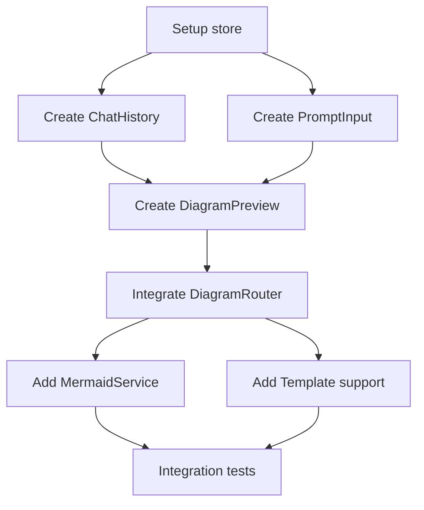

# Implementation Plan: Agent Mode

**Feature**: 001-agent-mode
**Created**: 2026-01-17
**Status**: Planning

## Technical Context

| Aspect | Decision | Rationale |
|--------|----------|-----------|
| **UI Framework** | React 18 + TypeScript | Already set up by background agents, modern, type-safe |
| **State Management** | Zustand | Simple, performant, already in dependencies |
| **AI Backend** | Claude API via Krypto Gateway | User's existing infrastructure |
| **Diagram Generation** | Mermaid.js primary, fallback to drawsvg | MIT licensed, 85k stars, text-to-diagram |
| **Chat Interface** | Custom component | Tailored to diagram preview needs |

## Constitution Check

| Principle | Compliance | Notes |
|-----------|------------|-------|
| I. AI-First Generation | ✅ COMPLIANT | Core feature - natural language to diagram |
| II. Publication-Ready | ✅ COMPLIANT | Mermaid SVG output is vector-quality |
| III. Domain-Specific | 🔶 PARTIAL | Templates to be added in 004-domain-libraries |
| IV. Tweakable | ✅ COMPLIANT | "Send to Editor" button planned |
| V. TDD | ✅ PLANNED | Tests before implementation |
| VI. Spec-Driven | ✅ COMPLIANT | This plan follows spec-kit |
| VII. Open Source | ✅ COMPLIANT | All dependencies MIT/Apache |

## Phase 0: Research

### Mermaid.js Integration
- **Decision**: Use mermaid.js for flowcharts, sequence, class, state diagrams
- **Rationale**: Native text-to-SVG, widely adopted, GitHub-compatible
- **Alternatives**: D2 (newer, less ecosystem), PlantUML (Java dependency)

### AI Prompt Routing
- **Decision**: Create DiagramRouter that analyzes prompt and selects backend
- **Rationale**: Different backends excel at different diagram types
- **Routing Logic**:
  - Flowchart keywords → Mermaid
  - Statistical keywords → Plotly
  - Mechanism keywords → Custom drawsvg
  - Generic → Claude direct SVG generation

## Phase 1: Data Model

### Entities

```typescript
interface Conversation {
  id: string;
  createdAt: Date;
  messages: Message[];
  currentDiagram: DiagramGeneration | null;
}

interface Message {
  id: string;
  role: 'user' | 'assistant';
  content: string;
  timestamp: Date;
  diagram?: DiagramGeneration;
}

interface DiagramGeneration {
  id: string;
  prompt: string;
  svgContent: string;
  backend: 'mermaid' | 'plotly' | 'drawsvg' | 'claude';
  generatedAt: Date;
  renderTimeMs: number;
}

interface Template {
  id: string;
  name: string;
  domain: string;
  promptTemplate: string;
  placeholders: string[];
}
```

## Phase 2: Component Architecture

```
src/
├── pages/
│   └── AgentMode/
│       ├── AgentMode.tsx          # Main page container
│       ├── ChatHistory.tsx        # Message list display
│       ├── PromptInput.tsx        # Input bar with send button
│       ├── DiagramPreview.tsx     # SVG preview with actions
│       └── TemplateGallery.tsx    # Template suggestions
├── services/
│   └── diagram/
│       ├── DiagramRouter.ts       # Route to correct backend
│       ├── MermaidService.ts      # Mermaid generation
│       ├── PlotlyService.ts       # Plotly generation
│       └── ClaudeService.ts       # Direct Claude SVG
└── store/
    └── conversationStore.ts       # Zustand store
```

## API Contracts

### Generate Diagram
```typescript
// POST /api/generate
interface GenerateRequest {
  prompt: string;
  conversationId?: string;
  preferredBackend?: 'mermaid' | 'plotly' | 'auto';
}

interface GenerateResponse {
  diagramId: string;
  svgContent: string;
  backend: string;
  renderTimeMs: number;
}
```

### Regenerate
```typescript
// POST /api/regenerate
interface RegenerateRequest {
  diagramId: string;
  variation?: 'different-layout' | 'different-style';
}
```

## Task Dependencies



## Quality Gates

- [ ] Unit tests for DiagramRouter (>80% coverage)
- [ ] Integration test: prompt → SVG generation
- [ ] Performance: <5s generation for simple diagrams
- [ ] Accessibility: keyboard navigation in chat
